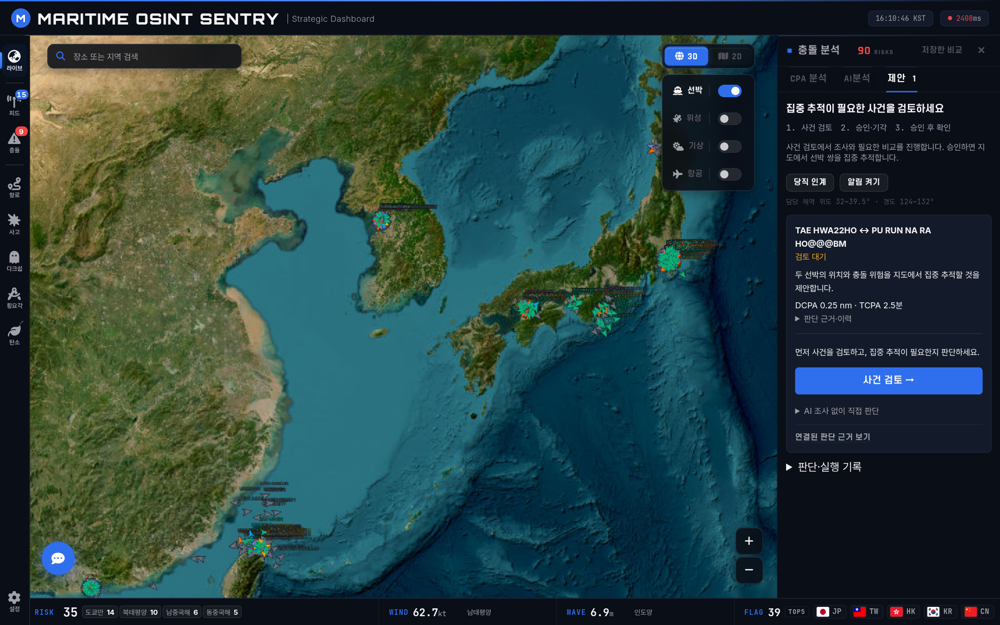
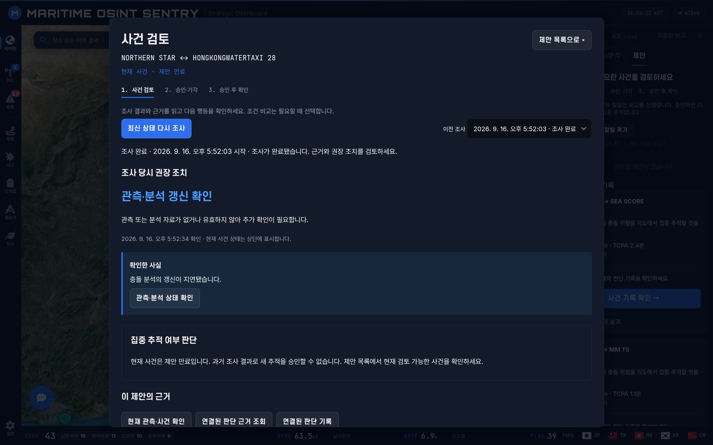
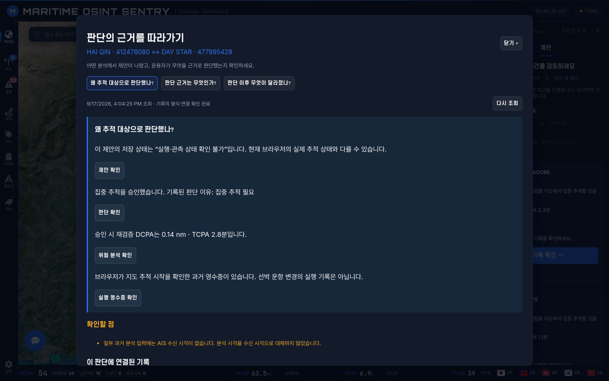
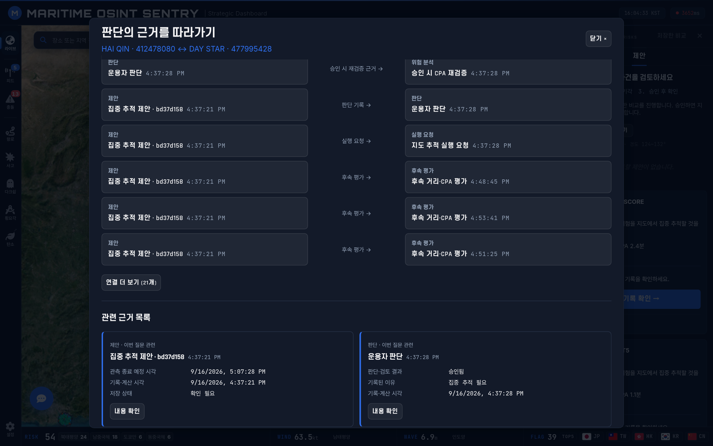
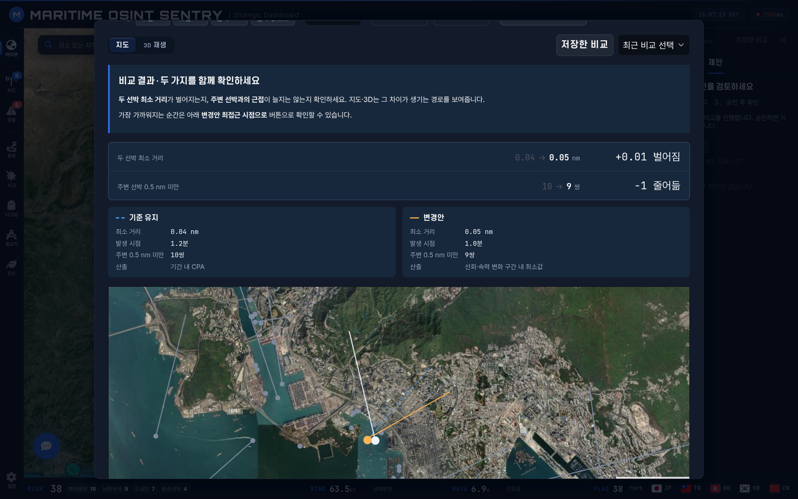
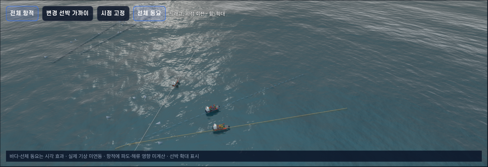
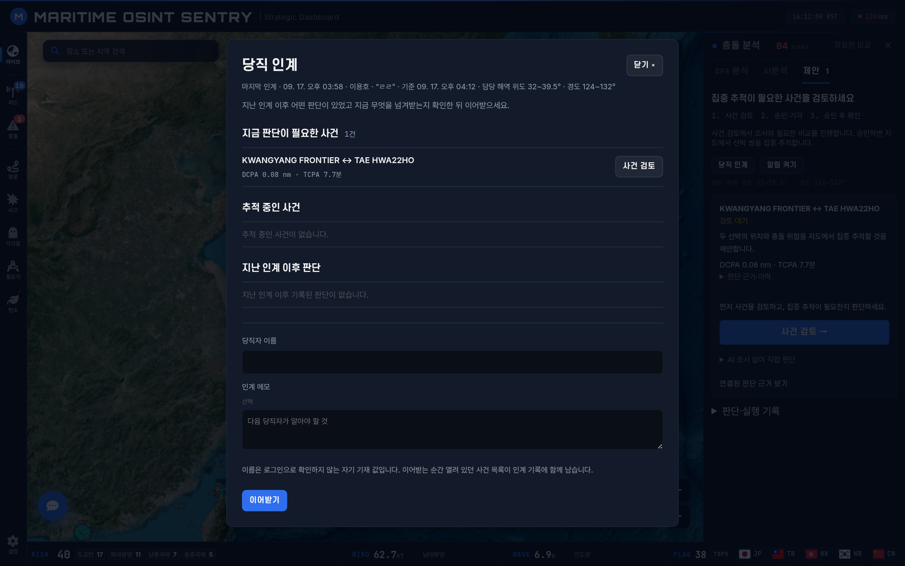

<div align="center">

# MSA Intelligent Platform

**Real-time Maritime Situational Awareness on a 3D Tactical Globe**

AIS 선박 추적 · 위성 궤도 전파 · 항공기 감시 · 이상 징후 탐지 · ML 기반 충돌 예측을
하나의 3D 전술 글로브 위에서 통합 운용하는 실시간 해양 상황인식(MSA) 플랫폼


</div>


## 데이터 플랫폼으로의 확장

AIS 원본 보관, 버전별 정제·품질 기록, 데이터셋 API, 파일 내보내기·복원·재처리를 지원하는 로컬 기반을 추가했습니다. 기존 해양 지도와 분석 기능을 유지하며 클라우드 저장·분석 계층으로 확장합니다. 현재는 단일 호스트 검증 단계이며 클라우드 리소스는 배포하지 않았습니다.

[첫 실행·데이터 계약·클라우드 로드맵](docs/data-platform/README.md)

## 시스템 개요

- **풀스택 지리공간 엔지니어링** — CesiumJS/Leaflet 프론트엔드, FastAPI 백엔드, PostGIS 공간 쿼리, WebSocket 실시간 파이프라인
- **ML 기반 충돌 위험 예측** — XGBoost 충돌 위험 모델 (14개 피처, 4단계 분류) 학습, 컨테이너화, REST API 서빙
- **다중 소스 데이터 퓨전** — AIS 라이브 스트림, SGP4 위성 궤도, OpenSky 항공기, Sentinel-2 위성 영상, GSHHG 해안선 데이터를 단일 작전 화면에 통합
- **지휘통제(C2)형 결심 지원** — 위험 쌍을 우선순위 보드로 추리고, 로컬 LLM 에이전트가 근거를 모아 권장하며, 사람이 결정하면 실행 확인·후속 관측·판단 근거를 W3C PROV-O 온톨로지 리니지로 남기는 당직 워크플로

## 아키텍처

해양·항공·위성 데이터를 단일 FastAPI 백엔드로 수집·융합하고, 무거운 추론(충돌 예측·LLM)은 별도 서비스로 분리한 MSA 구조입니다.

```
        데이터 소스                   백엔드 (FastAPI · Python 3.12)            프론트엔드
┌───────────────────────┐        ┌──────────────────────────────┐      ┌────────────────────┐
│ AisStream.io   (AIS)  │──WS───▶│ routers                       │      │ CesiumJS  3D Globe │
│ TLE / SGP4   (위성)   │───────▶│   ships · collision · hazard  │◀─WS─▶│ Leaflet   2D Map   │
│ OpenSky      (항공기) │───────▶│   route · satellites · chat   │      │ Three.js  Roll/Route│
│ Sentinel-2   (영상)   │───────▶│   aircraft · weather · events │      └────────────────────┘
│ GSHHG        (해안선) │───────▶│ services                      │
│ Searoute     (항로)   │───────▶│   ais_stream · collision_     │
│ 기상 API              │───────▶│   analyzer · land_filter ·    │
└───────────────────────┘        │   hazard_cells · llm_agent    │
                                  └───────────────┬──────────────┘
                                                  │ REST
                ┌─────────────────────────────────┼───────────────────────────┐
          ┌─────▼──────┐                   ┌───────▼────────┐          ┌────────▼────────┐
          │  PostGIS   │                   │  da10-service  │          │  Ollama (LLM)   │
          │ 공간 쿼리  │                   │ XGBoost 충돌AI │          │  tool-calling   │
          └────────────┘                   └────────────────┘          └─────────────────┘

                   모니터링 :  Prometheus  ·  Grafana  ·  Redis
```

**결심 지원 계층**(위 다이어그램의 routers/services에 포함) — `routers/proposals · investigations · knowledge`, `services/watch_officer`(우선순위 보드·승인·영수증), `services/investigation_agent`(pydantic-ai 도구 루프, Ollama), `ontology/evidence`(rdflib·pyshacl로 SQLite 기록을 PROV-O 그래프로 투영). 판단 기록은 단일 호스트 SQLite(WAL)에 트랜잭션으로 직렬화합니다.

## 로드맵

| 단계 | 상태 | 설명 |
|------|------|------|
| **감시 대시보드** | 완료 | 실시간 AIS·항공기 추적, 이상 징후 피드, 듀얼 맵 모드 |
| **충돌 AI 모델** | 완료 | XGBoost 위험 예측 + 3단계 공간 전처리 필터 + 육지 차폐 |
| **데이터 플랫폼 기반** | 로컬 구현 | AIS 원본 저널·정제·품질 기록·조회·복원 |
| **클라우드 데이터 플랫폼** | 예정 | 객체 저장소·Parquet·SQL 분석·운영 자동화 |
| **당직 결심 지원** | 로컬 구현 | 우선순위 보드·AI 사건 검토·온톨로지 근거·회피 조건 비교·브라우저 알림·당직 인계 |

## 주요 기능

### 실시간 선박 추적 (AIS)

| 3D Globe | 2D Map |
|----------|--------|
|  |  |

- **AisStream.io** 라이브 스트림 연동
- CesiumJS 전술 글로브와 고정밀 동기화
- 선박 상세 정보: MMSI, 선명, 선종, SOG, COG, 목적지
- **BillboardCollection** 기반 고성능 선박 렌더링 (전 세계 3만+ 선박 동시 추적)
- **3D Globe** (CesiumJS) ↔ **2D Map** (Leaflet) 듀얼 맵 모드, 마지막 뷰포트 공유 전환

### 실시간 항공기 추적 (OpenSky)

- **OpenSky Network** `/states/all` REST API를 10초 주기로 폴링하여 전 세계 항공기 위치를 인메모리 캐시로 유지
- **자동 분류** — ADS-B 카테고리 코드 + ICAO24 군용 주소 블록(미국·영국·프랑스·독일·러시아·중국·한국·일본 등)을 활용해 민항기/군용기/헬리콥터/기타로 구분
- 고도·속도·기수·상승률 등 상태벡터 표시, 지상 트래픽 및 60초 이상 미갱신 항적 자동 제거
- 폴링 실패 시 지수 백오프(최대 120초) 적용한 백그라운드 데몬 스레드

### 충돌 위험 분석 (이중 엔진)


- **거리 기반 분석**: 공간 그리드 필터링(5nm 반경)을 통한 TCPA/DCPA 계산
- **Class A/B 차등 임계값**: AIS 트랜스폰더 클래스(대형 Class A / 소형 Class B)에 따라 선박 쌍별 임계값 자동 조정

  | 조합 | DCPA 위험 | DCPA 경고 | TCPA 상한 |
  |------|----------|----------|----------|
  | A-A (대형-대형) | 0.5nm | 1.0nm | 20분 |
  | A-B (대형-소형) | 0.3nm | 0.7nm | 15분 |
  | B-B (소형-소형) | 0.2nm | 0.5nm | 10분 |

- **ML 모델 분석**: da10-service를 통한 XGBoost 기반 충돌 위험도 예측 (0~3 등급). COG 차이, 접근 신호, 베어링 분석 등 14개 입력 파라미터 활용.
- **육지 차폐 필터**: GSHHG 해안선 데이터를 활용하여 육지로 분리된 선박 쌍 자동 제외
- **인터랙티브 시각화**: COG 예상 경로선, CPA(최근접점) 마커·라벨, CPA 위험 영역 원(펄스), 위험도 색상 코딩

### 2D 해역 위험도 분석


- **헥스 그리드 위험도 레이어** — 사고/충돌/혼잡 점수를 육각 셀로 시각화 (위험·경고·주의 단계별 색상 코딩)
- **영역 분석 도구** — 드래그 사각형으로 선택한 해역의 평균/최대 위험도 및 위험 사유 자동 집계
- **해도 베이스맵** — 위성 영상 / 해도(nautical chart) 토글, 위험 셀 가독성을 위한 컨테이너 필터 적용
- 2D ↔ 3D 모드 전환 시 마지막 뷰포트 자동 복원

### 횡요각 3D 시뮬레이션 (Roll Viewer)


- **Three.js 기반 3D 선박 모델** — 선종별(화물선, 유조선, 여객선, 어선, 군함, 예인선) 전용 3D 모델 렌더링
- **실시간 횡요각/종요각 시뮬레이션** — 해상 기상 데이터(풍속, 파고, 파주기)를 반영한 물리 기반 롤링 시뮬레이션
- **선종별 롤링 특성** — 선박 유형에 따라 진폭과 주기를 차등 적용 (어선: 높은 진폭/빠른 주기, 유조선: 낮은 진폭/느린 주기)
- **실시간 차트** — 횡요각(Roll)·종요각(Pitch) 이력을 실시간 그래프로 표시
- **해양 환경 렌더링** — 파도 애니메이션, 뱃머리 물보라 파티클, 동적 하늘 배경
- **빈 상태 빠른 선택** — 추적 중인 선박(한국 근해·대형선 우선)을 카드에서 바로 선택

### 관습 항로 시뮬레이션 (Route Viewer)


- **관습 항로 산출** — Searoute 해상 항로 네트워크 기반으로 출발–도착 항구 간 실제 항로(육지 회피·해협 경유)를 계산하고, centripetal Catmull-Rom 스플라인으로 부드럽게 렌더링
- **2D 해상 지도** — 위성/해도 베이스맵 위에 항로 표시 (국내 항구 간 관습 항로에 최적화)
- **항구 선택** — 주요 국내 항구 마커·이름표 클릭, 이름 검색, 또는 크로스헤어로 좌표 직접 지정
- **선박 크기 등급(A~E)** — 선박 길이 등급 입력 — 흘수에 따른 수심 통항 제약을 반영하는 항로 모델용
- **항해 시뮬레이션** — 선박이 항로를 따라 이동하는 애니메이션(속력 x1~x2000) + 총 거리·예상 소요·ETA·통과 해역 표시

### LLM 어시스턴트 (Ollama Tool-Calling)


- **자연어 채팅 인터페이스** — Ollama 모델 기반, 도구 호출을 통한 데이터 조회 및 화면 제어
- **프론트엔드 상태 인식** — 현재 화면(횡요각 뷰어 등)과 표시 중인 선박을 매 턴 컨텍스트로 주입하여 "이 배", "현재 선박" 같은 지시 표현 처리
- **시나리오 제어 도구** — 자연어로 횡요각 뷰어의 날씨/속도 오버라이드, 선회 시나리오, 전복 시뮬레이션 트리거
- 지원 도구: `get_ships`, `get_collision_risks`, `get_area_status`, `get_ship_detail`, `fly_to`, `filter_ships`, `open_roll_viewer`, `return_to_globe`, `trigger_capsize`, `set_turn_scenario`, `set_roll_scenario`
- 연결 풀링 + Ollama `keep_alive`로 모델 상시 로드, 응답 지연 최소화

## 당직 결심 지원 — 지휘통제(C2)형 워크플로

전 세계 선박을 보여주는 상황판 위에, **당직자가 지금 판단해야 할 위험만 추려 근거를 모아주고, 사람의 결정을 실행 확인·후속 관측·판단 근거까지 하나의 사슬로 남기는** 결심 지원 계층을 얹었습니다. 시스템은 제안하고 **결정은 사람이** 합니다. 선박에 항해 명령을 보내는 기능은 없으며, 여기서 "통제"는 운용자의 결심 사슬을 끊김 없이 관리하고 사후에 증명할 수 있게 하는 것을 뜻합니다.

```
 탐지        추림          검토          결심        실행 확인       후속          기록
충돌 스캐너 → 우선순위 보드 → AI 사건 검토 → 승인·기각 → 브라우저 영수증 → 관측 재평가 → 온톨로지 근거
(10초 주기)  (정원·담당해역)  (로컬 LLM 에이전트) (사람)     (지도 집중 추적)   (위험 변화)   (PROV-O 리니지)
```

### 우선순위 보드 — 경보 목록이 아니라 "지금 가장 위험한 N건"



- **정원제 우선순위 보드** — 열린 제안은 `WATCH_MAX_OPEN`(기본 10)건으로 제한하고 ML 고위험 → DCPA 작은 순 → TCPA 임박한 순으로 채웁니다. 전역 피드에서는 임계값을 조여도 근접 쌍이 줄지 않기 때문입니다(아래 *운영 데이터로 재설계* 참고).
- **관측 지연 ≠ 위험 해소** — AIS가 잠시 끊긴 사건은 닫지 않고 `관측 지연`으로 표시하며 승인만 잠급니다. 수신이 돌아오면 같은 사건을 이어서 검토합니다. 공백이 5분을 넘기면 그때 만료합니다.
- **담당 해역(AOR)** — 제안·알림·인계는 `WATCH_AOR_BOX`(기본 한국 근해) 안의 사건만 새로 만듭니다. 상황판의 수신 범위와 분리해, 보는 범위는 넓게 두고 책임 범위만 좁힙니다. 설정이 잘못되면 **넓히는 쪽으로** 실패합니다(필터 해제).
- **쿨다운 분리** — 운용자가 기각한 쌍은 30분, 시스템 사정(관측 공백)으로 끝난 쌍은 60초 뒤 재시도합니다. 위험이 계속되는 쌍을 도구가 가리지 않게 합니다.

### AI 사건 검토 — 모델이 제안하고 서버가 검증하는 에이전트



- **로컬 LLM 도구 루프** — `pydantic-ai` + Ollama. 에이전트가 `현재 관측·사건 확인 → 연결된 판단 근거 조회 → CPA 재계산 → 가정 시나리오 비교` 도구를 순차 실행하고 권장 조치를 제출합니다. 호출·토큰 한도가 있습니다.
- **서버가 결론의 허용 범위를 정합니다** — 모델이 어떤 조치를 권하든, 서버는 현재 관측·기록 검증 상태만으로 허용되는 조치를 계산하고(`permitted_recommendation`) 어긋나는 답을 거절합니다(`ModelRetry`). 모델은 **서버가 기록한 근거 ID를 인용해야만** 답이 통과하며, 발행 직전에 최신 데이터로 한 번 더 재검증합니다.
- **계산이 결론을 바꾸지 못하면 도구를 막고 이유를 말합니다** — 관측이 낡아 결론이 "갱신 확인"이면 CPA 재계산·시나리오 비교를 실행하지 않고, 화면에 그 이유를 설명합니다. 실행한 도구는 모두 근거로 남아 `확인 결과`에서 원자료를 볼 수 있습니다.
- **승인은 사람이, 60초 안에** — 조사 결과로 승인할 수 있는 시간은 확인 후 60초이며 카운트다운이 보입니다. 승인 요청은 서버가 다시 검증하고, 통과한 승인만 지도 집중 추적을 실행합니다.

### 온톨로지 판단 근거 — "왜 그렇게 판단했나"를 리니지로 답한다

| 질문에 대한 답 | 기록 사이의 관계 |
|----------------|------------------|
|  |  |

- **W3C PROV-O 위의 해양 어휘** — OWL 온톨로지([maritime.ttl](backend/ontology/maritime.ttl))가 관측·분석·제안·판단·실행 요청·브라우저 영수증·후속 평가·AI 조사·시나리오 등 15개 클래스와 18개 관계를 정의하고, 모든 기록을 `prov:Entity`, 파생 관계를 `prov:wasDerivedFrom`으로 상속합니다.
- **세 가지 고정 질문** — *왜 추적 대상으로 판단했나 / 판단 근거는 무엇인가 / 판단 이후 무엇이 달라졌나*. 답은 고정 SPARQL 조회 결과를 정해진 문장 틀에 넣어 만들고 문장마다 근거 노드를 붙입니다. **LLM이 설명문을 쓰지 않습니다.**
- **판단 시점 보존** — SHACL 규칙([shapes.ttl](backend/ontology/shapes.ttl))이 "판단 이후 작성된 검토가 당시 근거로 연결됨", "AI 조사 확인 시각이 판단보다 늦음" 같은 소급 오염을 잡아냅니다. 검증에 실패하면 AI 에이전트가 권할 수 있는 조치도 `운용자 추가 검토`로 제한됩니다.
- **레코드 단위 리니지** — 그래프의 모든 노드는 원본 기록의 경로 + JSON 포인터 + 지문에 묶입니다. `내용 확인`은 그 바이트를 그대로 돌려주고, 기록이 갱신됐으면 409를 내며 화면이 자동으로 새 지문을 받아 재시도합니다.
- 사건 관계 데이터(RDF), 온톨로지 정의·검증 규칙(TTL)을 내보낼 수 있습니다. 온톨로지 그래프는 저장하지 않고 조회 시점에 SQLite 기록에서 다시 만듭니다.

### 회피 조건 what-if 비교 — 효과와 부작용을 먼저





- **같은 항적을 3D로 재생** — 2D 지도와 3D(Three.js)가 동일한 저장 표본(10초 간격)을 공유하고 시간 슬라이더·재생 위치도 함께 움직입니다. `전체 항적`은 기준 점선·변경안 실선·주변 선박을 한눈에, `변경 선박 가까이`는 변경 대상을 따라가며 회피 기동이 실제로 어떻게 보이는지 보여줍니다. `시점 고정`으로 카메라를 세워 선박이 지나가는 모습을, 1·3·10·30배속으로 재생합니다.
- **보이는 것과 계산된 것을 구분합니다** — Gerstner 파도 수면과 선체 동요(횡요 최대 5°·종요 2.5°)는 시각 효과이며 저장된 비교 수치에 영향을 주지 않습니다. 선박 모델은 가독성을 위해 확대돼 있어 선체가 겹쳐 보여도 충돌 판정이 아닙니다. 화면 하단에 이 사실을 항상 표시합니다.

- **동일한 시작 조건**에서 기준 유지와 변경안(한 척의 속력·침로 변경)을 계산합니다. 주변 10해리·최대 50척의 AIS를 스냅샷으로 얼려 재생에 현재 AIS를 다시 쓰지 않습니다.
- **결과는 차이부터** — `두 선박 최소 거리`(효과)와 `주변 선박 0.5nm 미만 쌍`(부작용)을 `기준 → 변경안`과 변화량으로 보여줍니다. A를 피하려다 C를 끌어들이는 회피를 한 줄에서 잡습니다.
- **색은 주의가 필요한 방향에만** — 벌어진 쪽을 초록으로 칠하지 않습니다. 이 계산은 해안·수심·항법규칙·기상을 평가하지 않는 가정 비교이며 안전 판정이 아니기 때문입니다.
- 선회·가감속 램프 모델(1초 적분), 2D 지도·3D 재생, `우현 20°·좌현 20°·감속 50%` 프리셋. 조건을 바꾸지 않으면 계산이 잠깁니다(기준 = 변경안인 무의미한 비교 방지).

### 브라우저 알림 · 당직 인계



- **알림은 두 가지만** — 최근접 5분 이내로 임박한 사건, 새로 최상위 위험이 된 사건. 관측 지연 사건은 승인할 수 없으므로 알리지 않고, 같은 선박쌍은 10분 안에 다시 울리지 않으며, 제안 탭을 보고 있으면 침묵합니다. **알림에서 승인은 할 수 없습니다** — 승인은 서버 재검증 → 지도 추적 → 브라우저 영수증이 한 사슬이라, 밖에서 승인하면 영수증이 빠집니다.
- **당직 인계** — 지난 인계 이후의 판단, 지금 판단이 필요한 사건(위험 순서), 추적 중인 사건을 한 화면에 모으고, `이어받기` 시점에 열려 있던 사건 목록을 인계 기록에 함께 남깁니다. 상태가 10초마다 바뀌는 사건을 메일 스레드로 넘기지 않고 앱 안에서 인계합니다.
- **DB 하나당 스캐너 하나** — 같은 DB를 여는 백엔드가 여럿이면 임대를 쥔 한 곳만 제안을 갱신합니다.

### 운영 데이터로 재설계 — 임계값이 아니라 모델이 문제였다

48.8시간 운영 기록(제안 26,859건)을 분석해 다음을 확인하고 구조를 바꿨습니다.

| 측정 | 결과 |
|------|------|
| 만료된 제안 | **26,828건 (99.97%)** · 운용자가 실제 판단한 건 8건 |
| 만료까지 걸린 시간 | **중앙값 35초** · 84%가 60초 이내 · AI 조사 1회 ~16초 → 조사가 끝나기 전에 대상이 사라짐 |
| 만료 사유 1위 | AIS 수신 공백 `vessel_stale` 64% |
| 같은 쌍 재제안 간격 | 4,243건 중 1,800초 미만 **0건** → 30분 쿨다운이 위험이 계속되는 쌍을 가리고 있었음 |
| 임계값 실험 | DCPA 5.0nm와 1.0nm의 제안 수가 **동일**(551건/시) · 0.3nm로 낮춰도 290건/시 → 임계값은 구속 조건이 아님 |

→ "쌍마다 경보"를 "지금 가장 위험한 N건" 보드로 바꾸고, 관측 공백과 위험 해소를 분리하고, 쿨다운을 운용자 판단과 시스템 사정으로 나누고, 담당 해역을 도입했습니다. 각 변경은 운영 기록의 수치를 근거로 테스트에 명시돼 있습니다.

### 안전 설계 원칙

- **결정은 사람, 시스템은 제안·기록** — 승인·기각과 그 이유는 운용자가 남깁니다.
- **실행은 화면 집중 추적까지** — 선박에 명령을 보내지 않습니다. 실행의 증거는 브라우저 영수증이며, 응답이 유실돼도 조치를 임의로 재실행하지 않습니다.
- **안전 판정이 아님** — 충돌 위험 계산은 항법규칙(COLREG)·해안·수심·기상을 평가하지 않습니다. 위험 감소는 후속 관측으로 기록하되, 집중 추적이 원인이라고 주장하지 않습니다.
- **실패는 넓히는 쪽으로** — 담당 해역 설정 오류는 필터 해제로, 위치를 모르는 선박은 포함으로 처리해 위험을 조용히 놓치지 않습니다.

문서: [당직사관 규칙·상태·API](docs/features/watch-officer.md) · [AI 사건 조사](docs/features/ai-investigation.md) · [온톨로지 근거](docs/features/ontology-evidence.md) · [시나리오 비교](docs/features/collision-scenarios.md)

## 설계 근거

"무엇을 만들었나"만큼 "왜 그렇게 설계했나"가 중요했습니다. 핵심 설계 결정 네 가지를 정리합니다.

### 1. 다중 소스 데이터 퓨전 — 왜 단일 작전 화면인가

> **한계** — AIS(선박), TLE(위성), OpenSky(항공기), Sentinel-2(영상)는 각각 좌표계·갱신 주기·전송 방식(WebSocket/REST/궤도 전파)이 모두 다릅니다. 따로 보면 "지금 이 해역에서 무슨 일이 벌어지는가"를 한눈에 파악할 수 없습니다.

> **해결** — 각 소스를 전용 라우터/서비스로 수집하되, 좌표는 단일 WGS84 글로브로 정규화하고 시간 축을 맞춰 동일한 3D 전술 글로브 위에 중첩했습니다. 갱신 주기가 다른 소스(AIS 실시간 스트림 vs OpenSky 10초 폴링 vs SGP4 궤도 전파)는 각자의 캐시에서 독립적으로 갱신되며, 프론트엔드는 단일 좌표 공간에서 이를 합성합니다.

> **결과** — 선박·항공기·위성·위험 해역을 하나의 화면에서 동시에 운용하는 통합 상황인식(MSA)을 달성했습니다.

### 2. 충돌 위험 예측 — 거리 계산만으로 부족한 이유

> **한계** — 전 세계 3만+ 선박을 모든 쌍으로 비교하면 O(n²)로 폭증하고, 단순 거리/CPA 계산은 "서로 멀어지는 중인 선박"이나 "육지로 가로막힌 선박"까지 위험으로 오탐합니다.

> **해결** — 공간 그리드 필터(5nm)로 후보를 좁힌 뒤, **3단계 전처리 필터 파이프라인**과 **육지 차폐**로 실제 충돌 가능 쌍만 남기고, 그 위에 XGBoost 모델(14개 피처)로 위험도를 등급화합니다.

> **결과** — 거대 실시간 피드에서도 의미 있는 위험쌍만 추출하여, 거리 기반(빠른 1차 판정)과 ML 기반(정밀 등급화)을 결합한 이중 엔진을 구성했습니다.

<details>
<summary><b>충돌 판정 알고리즘 상세 (클릭하여 펼치기)</b></summary>

**3단계 전처리 필터 파이프라인**

1. **Range rate 검증**: 거리가 줄어들고 있는 쌍만 통과 (발산 선박 즉시 제거)
2. **COG 투영선 수렴 검사**: COG 방향 벡터를 직선으로 투영하여, 교차점이 양쪽 전방에 있는 경우(crossing/head-on) 또는 평행한 경우(overtaking)만 통과
3. **베어링 검증**: head-on/crossing은 양쪽 모두 상대를 향해야 하고(90° 이내), overtaking은 한 척만 향하면 통과

**육지 차폐 필터**: GSHHG 해안선 데이터를 활용하여 육지로 분리된 선박 쌍을 자동 제외하여, 직선거리로는 가깝지만 물리적으로 충돌 불가능한 쌍을 걸러냅니다.

**ML 등급화**: da10-service의 XGBoost 모델이 COG 차이, 접근 신호, 베어링 분석 등 14개 입력 파라미터로 0~3 등급의 위험도를 산출합니다.

</details>

### 3. 항공기 분류 — 군용/민항 식별을 어떻게 하는가

> **한계** — OpenSky 상태벡터의 ADS-B 카테고리 코드만으로는 군용기를 안정적으로 식별할 수 없습니다(군용기는 카테고리를 비우거나 위장하는 경우가 많음).

> **해결** — ADS-B 카테고리(경량/소형/대형/헬리콥터 등)를 기본 분류로 쓰되, **ICAO24 16진 주소 블록**을 국가별 군용 할당과 대조하여 군용기를 우선 식별합니다. 고성능기(카테고리 7)도 군용 거동으로 분류합니다.

> **결과** — 민항기·군용기·헬리콥터·기타로 구분하여, 60초 staleness 기준으로 신뢰 가능한 항적만 렌더링합니다.

### 4. 결심 지원 — 왜 경보가 아니라 우선순위 보드이고, 왜 LLM이 결론을 정하지 못하는가

> **한계** — 전역 AIS 피드에서 "조건을 만족하는 쌍마다 경보"를 만들면 시간당 551건이 쏟아지고, 그중 99.97%가 사람이 읽기 전에 만료됐습니다. 임계값을 17배 조여도 건수가 줄지 않았습니다. 한편 LLM에 판단을 맡기면 근거 없는 결론이 승인 경로에 들어갈 위험이 있습니다.

> **해결** — 경보를 정원제 우선순위 보드로 바꾸고 담당 해역으로 책임 범위를 잘랐습니다. AI는 도구를 실행해 근거를 모으고 권장만 하며, 서버가 현재 상태로 계산한 허용 조치와 어긋나는 답은 거절합니다. 모든 기록은 PROV-O 리니지로 연결해 "왜 그렇게 판단했나"에 고정 SPARQL과 정해진 문장으로 답합니다.

> **결과** — 당직자는 최악 N건만 위험 순서로 보고, AI가 모은 근거를 읽고, 60초 안에 결정하며, 그 결정은 브라우저 영수증·후속 관측·판단 근거와 함께 사후 검증 가능한 기록으로 남습니다.

## 기술 스택

- **프론트엔드**: CesiumJS, Leaflet, Three.js, Vanilla CSS, JavaScript (ES6+)
- **백엔드**: FastAPI (Python 3.12), Uvicorn
- **데이터베이스**: PostgreSQL + PostGIS
- **충돌 모델**: XGBoost (da10-service), GSHHG 해안선 shapefile (`shapely`, `pyshp`)
- **결심 지원**: `pydantic-ai` + Ollama(에이전트 도구 루프·출력 검증), `rdflib`·`pyshacl`(OWL/PROV-O 그래프·SHACL·SPARQL), SQLite WAL(판단·인계·임대 기록), Web Notifications API
- **데이터 소스**: AisStream.io (AIS), OpenSky Network (항공기), `sgp4` (위성), Sentinel-2 (영상)
- **항로/LLM**: `searoute`, Ollama (tool-calling)
- **모니터링**: Prometheus, Grafana, Redis
- **핵심 라이브러리**: `asyncpg`, `apscheduler`, `websockets`, `httpx`

## 시작하기

### 사전 요구사항
- [uv](https://docs.astral.sh/uv/) (`curl -LsSf https://astral.sh/uv/install.sh | sh`)
- PostgreSQL + PostGIS
- AISStream.io API Key

### 환경 설정
루트 디렉토리에 `.env` 파일 생성:
```env
DB_USER=your_user
DB_PASSWORD=your_password
DB_NAME=osint_4d
DB_HOST=127.0.0.1
DB_PORT=5432
AIS_API_KEY=your_aisstream_key
```

### 설치
```bash
uv sync
```

### 실행
```bash
uv run uvicorn backend.main:app --host 0.0.0.0 --port 8001
```

## 모니터링

모니터링 포함 전체 스택 실행:

```bash
cp .env.example .env  # 환경변수 설정 후 값 수정
docker compose -f docker-compose.yml -f docker-compose.monitoring.yml up -d
python -m uvicorn backend.main:app --host 0.0.0.0 --port 8001
```

| 서비스 | URL | 용도 |
|--------|-----|------|
| App | http://localhost:8001 | 해양 OSINT 대시보드 |
| Prometheus | http://localhost:9090 | 메트릭 수집 |
| Grafana | http://localhost:3001 | 모니터링 대시보드 (admin/admin) |
| Redis | localhost:6379 | 스트림 파이프라인 |

## 보안
API 키 및 데이터베이스 자격 증명은 `.gitignore`를 통해 보호됩니다. `.env` 파일은 절대 커밋하지 마세요.
