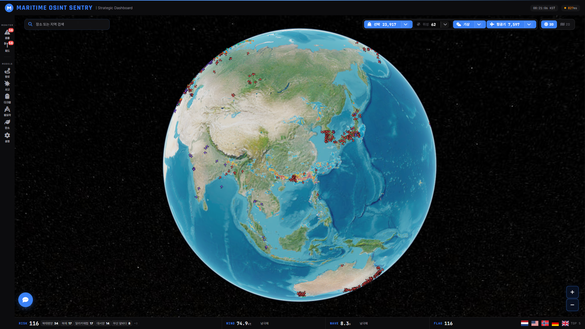
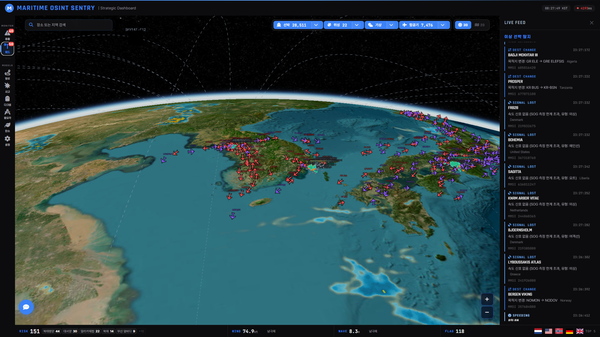
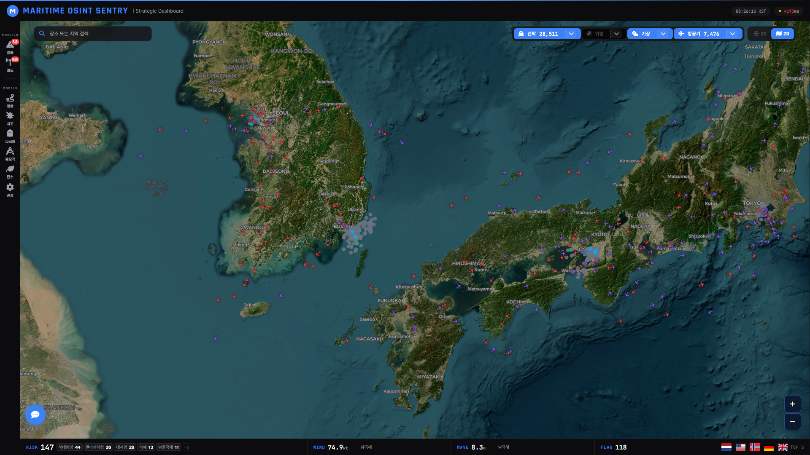
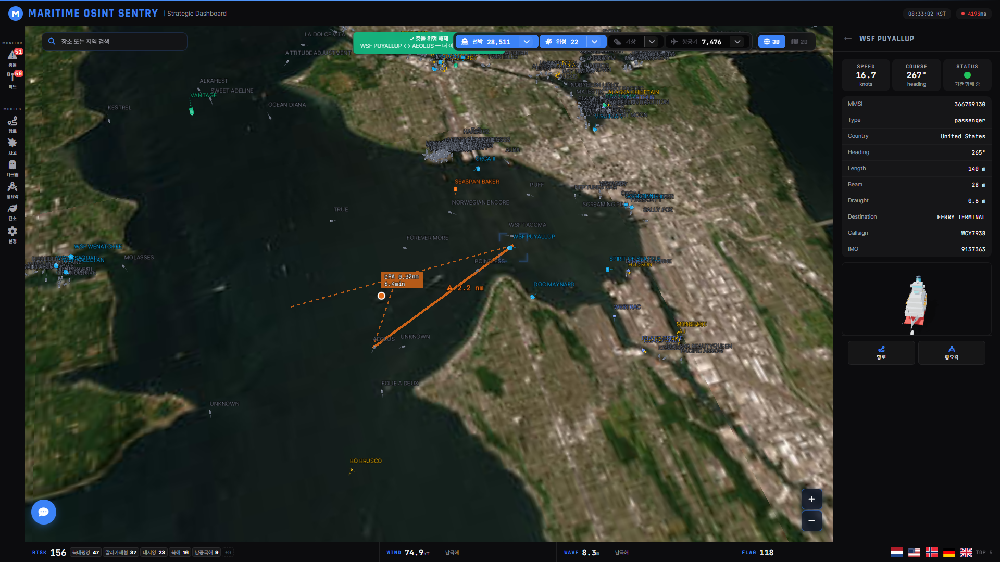
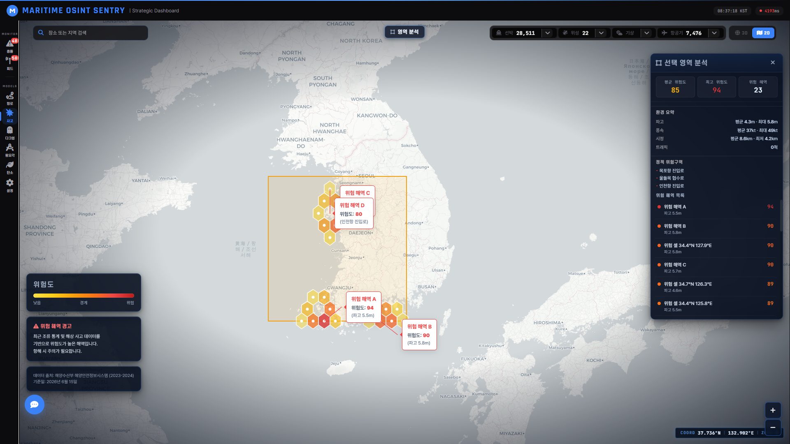
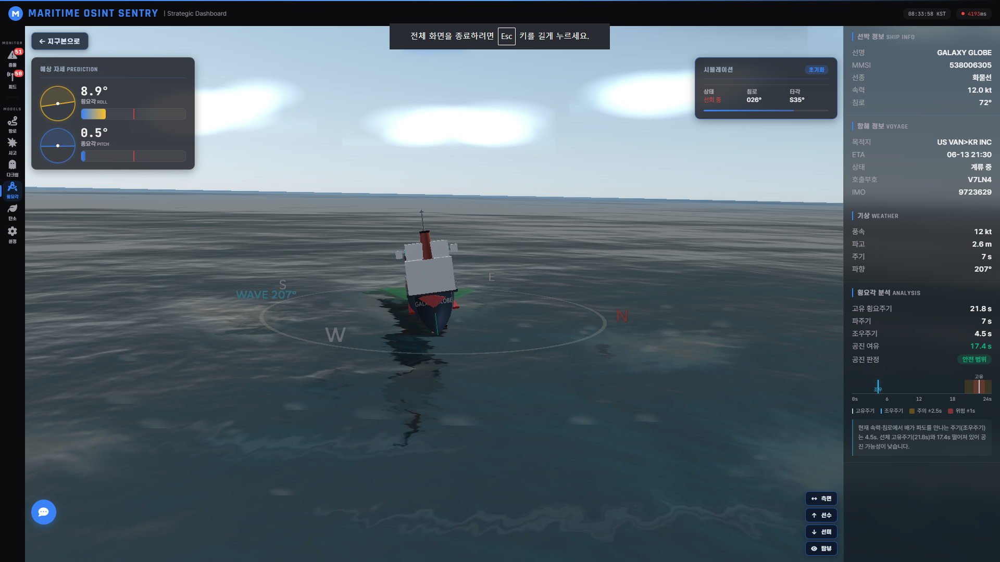
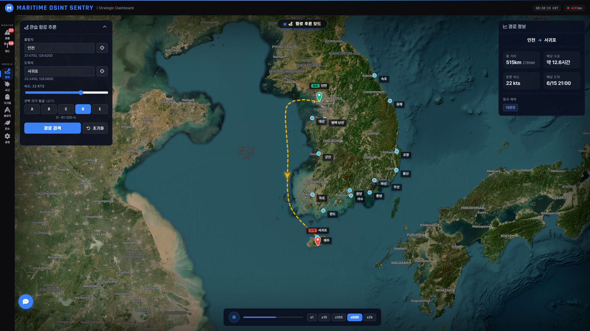
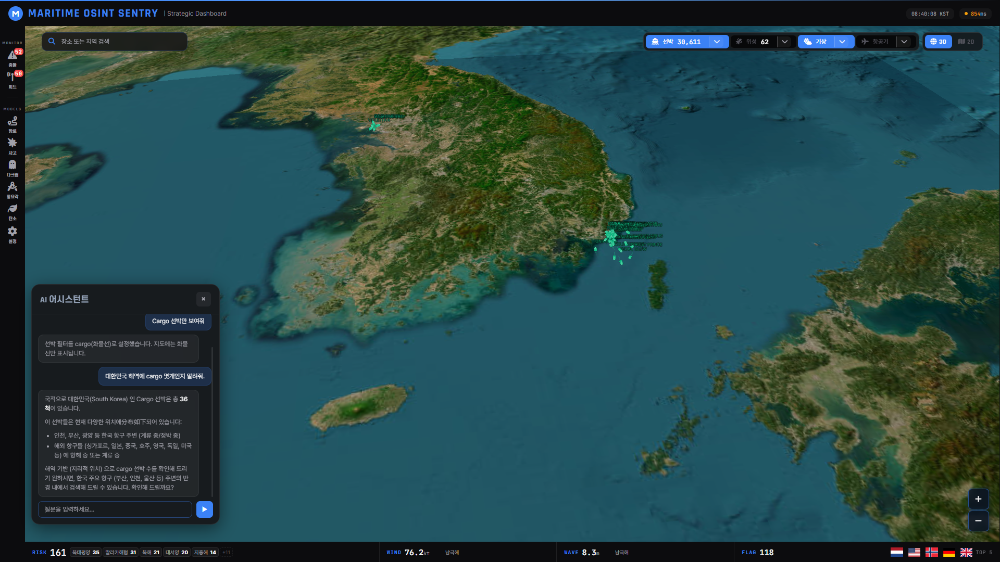

<div align="center">

# MSA Intelligent Platform

**Real-time Maritime Situational Awareness on a 3D Tactical Globe**

AIS 선박 추적 · 위성 궤도 전파 · 항공기 감시 · 이상 징후 탐지 · ML 기반 충돌 예측을
하나의 3D 전술 글로브 위에서 통합 운용하는 실시간 해양 상황인식(MSA) 플랫폼


</div>



## 시스템 개요

- **풀스택 지리공간 엔지니어링** — CesiumJS/Leaflet 프론트엔드, FastAPI 백엔드, PostGIS 공간 쿼리, WebSocket 실시간 파이프라인
- **ML 기반 충돌 위험 예측** — XGBoost 충돌 위험 모델 (14개 피처, 4단계 분류) 학습, 컨테이너화, REST API 서빙
- **다중 소스 데이터 퓨전** — AIS 라이브 스트림, SGP4 위성 궤도, OpenSky 항공기, Sentinel-2 위성 영상, GSHHG 해안선 데이터를 단일 작전 화면에 통합

## 아키텍처

해양·항공·위성 데이터를 단일 FastAPI 백엔드로 수집·융합하고, 무거운 추론(충돌 예측·LLM)은 별도 서비스로 분리한 MSA 구조입니다.

```
        데이터 소스                   백엔드 (FastAPI · Python 3.12)            프론트엔드
┌───────────────────────┐        ┌──────────────────────────────┐      ┌────────────────────┐
│ AisStream.io   (AIS)  │──WS───▶│ routers                       │      │ CesiumJS  3D Globe │
│ TLE / SGP4   (위성)   │───────▶│   ships · collision · hazard  │◀─WS─▶│ Leaflet   2D Map   │
│ OpenSky      (항공기) │───────▶│   route · satellites · chat   │      │ Three.js  Roll/Route│
│ Sentinel-2   (영상)   │───────▶│   aircraft · weather · events │      └────────────────────┘
│ GSHHG        (해안선) │───────▶│ services                      │
│ Searoute     (항로)   │───────▶│   ais_stream · collision_     │
│ 기상 API              │───────▶│   analyzer · land_filter ·    │
└───────────────────────┘        │   hazard_cells · llm_agent    │
                                  └───────────────┬──────────────┘
                                                  │ REST
                ┌─────────────────────────────────┼───────────────────────────┐
          ┌─────▼──────┐                   ┌───────▼────────┐          ┌────────▼────────┐
          │  PostGIS   │                   │  da10-service  │          │  Ollama (LLM)   │
          │ 공간 쿼리  │                   │ XGBoost 충돌AI │          │  tool-calling   │
          └────────────┘                   └────────────────┘          └─────────────────┘

                   모니터링 :  Prometheus  ·  Grafana  ·  Redis
```

## 로드맵

| 단계 | 상태 | 설명 |
|------|------|------|
| **감시 대시보드** | 완료 | 실시간 AIS·항공기 추적, 이상 징후 피드, 듀얼 맵 모드 |
| **충돌 AI 모델** | 완료 | XGBoost 위험 예측 + 3단계 공간 전처리 필터 + 육지 차폐 |
| **디지털 트윈** | 진행 | 시뮬레이션 레이어 — 횡요각 예측, 관습 항로, LLM 어시스턴트 |

## 주요 기능

### 실시간 선박 추적 (AIS)

| 3D Globe | 2D Map |
|----------|--------|
|  |  |

- **AisStream.io** 라이브 스트림 연동
- CesiumJS 전술 글로브와 고정밀 동기화
- 선박 상세 정보: MMSI, 선명, 선종, SOG, COG, 목적지
- **BillboardCollection** 기반 고성능 선박 렌더링 (전 세계 3만+ 선박 동시 추적)
- **3D Globe** (CesiumJS) ↔ **2D Map** (Leaflet) 듀얼 맵 모드, 마지막 뷰포트 공유 전환

### 실시간 항공기 추적 (OpenSky)

- **OpenSky Network** `/states/all` REST API를 10초 주기로 폴링하여 전 세계 항공기 위치를 인메모리 캐시로 유지
- **자동 분류** — ADS-B 카테고리 코드 + ICAO24 군용 주소 블록(미국·영국·프랑스·독일·러시아·중국·한국·일본 등)을 활용해 민항기/군용기/헬리콥터/기타로 구분
- 고도·속도·기수·상승률 등 상태벡터 표시, 지상 트래픽 및 60초 이상 미갱신 항적 자동 제거
- 폴링 실패 시 지수 백오프(최대 120초) 적용한 백그라운드 데몬 스레드

### 충돌 위험 분석 (이중 엔진)



- **거리 기반 분석**: 공간 그리드 필터링(5nm 반경)을 통한 TCPA/DCPA 계산
- **Class A/B 차등 임계값**: AIS 트랜스폰더 클래스(대형 Class A / 소형 Class B)에 따라 선박 쌍별 임계값 자동 조정

  | 조합 | DCPA 위험 | DCPA 경고 | TCPA 상한 |
  |------|----------|----------|----------|
  | A-A (대형-대형) | 0.5nm | 1.0nm | 20분 |
  | A-B (대형-소형) | 0.3nm | 0.7nm | 15분 |
  | B-B (소형-소형) | 0.2nm | 0.5nm | 10분 |

- **ML 모델 분석**: da10-service를 통한 XGBoost 기반 충돌 위험도 예측 (0~3 등급). COG 차이, 접근 신호, 베어링 분석 등 14개 입력 파라미터 활용.
- **육지 차폐 필터**: GSHHG 해안선 데이터를 활용하여 육지로 분리된 선박 쌍 자동 제외
- **인터랙티브 시각화**: COG 예상 경로선, CPA(최근접점) 마커·라벨, CPA 위험 영역 원(펄스), 위험도 색상 코딩

### 2D 해역 위험도 분석



- **헥스 그리드 위험도 레이어** — 사고/충돌/혼잡 점수를 육각 셀로 시각화 (위험·경고·주의 단계별 색상 코딩)
- **영역 분석 도구** — 드래그 사각형으로 선택한 해역의 평균/최대 위험도 및 위험 사유 자동 집계
- **해도 베이스맵** — 위성 영상 / 해도(nautical chart) 토글, 위험 셀 가독성을 위한 컨테이너 필터 적용
- 2D ↔ 3D 모드 전환 시 마지막 뷰포트 자동 복원

### 횡요각 3D 시뮬레이션 (Roll Viewer)



- **Three.js 기반 3D 선박 모델** — 선종별(화물선, 유조선, 여객선, 어선, 군함, 예인선) 전용 3D 모델 렌더링
- **실시간 횡요각/종요각 시뮬레이션** — 해상 기상 데이터(풍속, 파고, 파주기)를 반영한 물리 기반 롤링 시뮬레이션
- **선종별 롤링 특성** — 선박 유형에 따라 진폭과 주기를 차등 적용 (어선: 높은 진폭/빠른 주기, 유조선: 낮은 진폭/느린 주기)
- **실시간 차트** — 횡요각(Roll)·종요각(Pitch) 이력을 실시간 그래프로 표시
- **해양 환경 렌더링** — 파도 애니메이션, 뱃머리 물보라 파티클, 동적 하늘 배경
- **빈 상태 빠른 선택** — 추적 중인 선박(한국 근해·대형선 우선)을 카드에서 바로 선택

### 관습 항로 시뮬레이션 (Route Viewer)



- **관습 항로 산출** — Searoute 해상 항로 네트워크 기반으로 출발–도착 항구 간 실제 항로(육지 회피·해협 경유)를 계산하고, centripetal Catmull-Rom 스플라인으로 부드럽게 렌더링
- **2D 해상 지도** — 위성/해도 베이스맵 위에 항로 표시 (국내 항구 간 관습 항로에 최적화)
- **항구 선택** — 주요 국내 항구 마커·이름표 클릭, 이름 검색, 또는 크로스헤어로 좌표 직접 지정
- **선박 크기 등급(A~E)** — 선박 길이 등급 입력 — 흘수에 따른 수심 통항 제약을 반영하는 항로 모델용
- **항해 시뮬레이션** — 선박이 항로를 따라 이동하는 애니메이션(속력 x1~x2000) + 총 거리·예상 소요·ETA·통과 해역 표시

### LLM 어시스턴트 (Ollama Tool-Calling)



- **자연어 채팅 인터페이스** — Ollama 모델 기반, 도구 호출을 통한 데이터 조회 및 화면 제어
- **프론트엔드 상태 인식** — 현재 화면(횡요각 뷰어 등)과 표시 중인 선박을 매 턴 컨텍스트로 주입하여 "이 배", "현재 선박" 같은 지시 표현 처리
- **시나리오 제어 도구** — 자연어로 횡요각 뷰어의 날씨/속도 오버라이드, 선회 시나리오, 전복 시뮬레이션 트리거
- 지원 도구: `get_ships`, `get_collision_risks`, `get_area_status`, `get_ship_detail`, `fly_to`, `filter_ships`, `open_roll_viewer`, `return_to_globe`, `trigger_capsize`, `set_turn_scenario`, `set_roll_scenario`
- 연결 풀링 + Ollama `keep_alive`로 모델 상시 로드, 응답 지연 최소화

## 설계 근거

"무엇을 만들었나"만큼 "왜 그렇게 설계했나"가 중요했습니다. 핵심 설계 결정 세 가지를 정리합니다.

### 1. 다중 소스 데이터 퓨전 — 왜 단일 작전 화면인가

> **한계** — AIS(선박), TLE(위성), OpenSky(항공기), Sentinel-2(영상)는 각각 좌표계·갱신 주기·전송 방식(WebSocket/REST/궤도 전파)이 모두 다릅니다. 따로 보면 "지금 이 해역에서 무슨 일이 벌어지는가"를 한눈에 파악할 수 없습니다.

> **해결** — 각 소스를 전용 라우터/서비스로 수집하되, 좌표는 단일 WGS84 글로브로 정규화하고 시간 축을 맞춰 동일한 3D 전술 글로브 위에 중첩했습니다. 갱신 주기가 다른 소스(AIS 실시간 스트림 vs OpenSky 10초 폴링 vs SGP4 궤도 전파)는 각자의 캐시에서 독립적으로 갱신되며, 프론트엔드는 단일 좌표 공간에서 이를 합성합니다.

> **결과** — 선박·항공기·위성·위험 해역을 하나의 화면에서 동시에 운용하는 통합 상황인식(MSA)을 달성했습니다.

### 2. 충돌 위험 예측 — 거리 계산만으로 부족한 이유

> **한계** — 전 세계 3만+ 선박을 모든 쌍으로 비교하면 O(n²)로 폭증하고, 단순 거리/CPA 계산은 "서로 멀어지는 중인 선박"이나 "육지로 가로막힌 선박"까지 위험으로 오탐합니다.

> **해결** — 공간 그리드 필터(5nm)로 후보를 좁힌 뒤, **3단계 전처리 필터 파이프라인**과 **육지 차폐**로 실제 충돌 가능 쌍만 남기고, 그 위에 XGBoost 모델(14개 피처)로 위험도를 등급화합니다.

> **결과** — 거대 실시간 피드에서도 의미 있는 위험쌍만 추출하여, 거리 기반(빠른 1차 판정)과 ML 기반(정밀 등급화)을 결합한 이중 엔진을 구성했습니다.

<details>
<summary><b>충돌 판정 알고리즘 상세 (클릭하여 펼치기)</b></summary>

**3단계 전처리 필터 파이프라인**

1. **Range rate 검증**: 거리가 줄어들고 있는 쌍만 통과 (발산 선박 즉시 제거)
2. **COG 투영선 수렴 검사**: COG 방향 벡터를 직선으로 투영하여, 교차점이 양쪽 전방에 있는 경우(crossing/head-on) 또는 평행한 경우(overtaking)만 통과
3. **베어링 검증**: head-on/crossing은 양쪽 모두 상대를 향해야 하고(90° 이내), overtaking은 한 척만 향하면 통과

**육지 차폐 필터**: GSHHG 해안선 데이터를 활용하여 육지로 분리된 선박 쌍을 자동 제외하여, 직선거리로는 가깝지만 물리적으로 충돌 불가능한 쌍을 걸러냅니다.

**ML 등급화**: da10-service의 XGBoost 모델이 COG 차이, 접근 신호, 베어링 분석 등 14개 입력 파라미터로 0~3 등급의 위험도를 산출합니다.

</details>

### 3. 항공기 분류 — 군용/민항 식별을 어떻게 하는가

> **한계** — OpenSky 상태벡터의 ADS-B 카테고리 코드만으로는 군용기를 안정적으로 식별할 수 없습니다(군용기는 카테고리를 비우거나 위장하는 경우가 많음).

> **해결** — ADS-B 카테고리(경량/소형/대형/헬리콥터 등)를 기본 분류로 쓰되, **ICAO24 16진 주소 블록**을 국가별 군용 할당과 대조하여 군용기를 우선 식별합니다. 고성능기(카테고리 7)도 군용 거동으로 분류합니다.

> **결과** — 민항기·군용기·헬리콥터·기타로 구분하여, 60초 staleness 기준으로 신뢰 가능한 항적만 렌더링합니다.

## 기술 스택

- **프론트엔드**: CesiumJS, Leaflet, Three.js, Vanilla CSS, JavaScript (ES6+)
- **백엔드**: FastAPI (Python 3.12), Uvicorn
- **데이터베이스**: PostgreSQL + PostGIS
- **충돌 모델**: XGBoost (da10-service), GSHHG 해안선 shapefile (`shapely`, `pyshp`)
- **데이터 소스**: AisStream.io (AIS), OpenSky Network (항공기), `sgp4` (위성), Sentinel-2 (영상)
- **항로/LLM**: `searoute`, Ollama (tool-calling)
- **모니터링**: Prometheus, Grafana, Redis
- **핵심 라이브러리**: `asyncpg`, `apscheduler`, `websockets`, `httpx`

## 시작하기

### 사전 요구사항
- [uv](https://docs.astral.sh/uv/) (`curl -LsSf https://astral.sh/uv/install.sh | sh`)
- PostgreSQL + PostGIS
- AISStream.io API Key

### 환경 설정
루트 디렉토리에 `.env` 파일 생성:
```env
DB_USER=your_user
DB_PASSWORD=your_password
DB_NAME=osint_4d
DB_HOST=127.0.0.1
DB_PORT=5432
AIS_API_KEY=your_aisstream_key
```

### 설치
```bash
uv sync
```

### 실행
```bash
uv run uvicorn backend.main:app --host 0.0.0.0 --port 8001
```

## 모니터링

모니터링 포함 전체 스택 실행:

```bash
cp .env.example .env  # 환경변수 설정 후 값 수정
docker compose -f docker-compose.yml -f docker-compose.monitoring.yml up -d
python -m uvicorn backend.main:app --host 0.0.0.0 --port 8001
```

| 서비스 | URL | 용도 |
|--------|-----|------|
| App | http://localhost:8001 | 해양 OSINT 대시보드 |
| Prometheus | http://localhost:9090 | 메트릭 수집 |
| Grafana | http://localhost:3001 | 모니터링 대시보드 (admin/admin) |
| Redis | localhost:6379 | 스트림 파이프라인 |

## 보안
API 키 및 데이터베이스 자격 증명은 `.gitignore`를 통해 보호됩니다. `.env` 파일은 절대 커밋하지 마세요.
