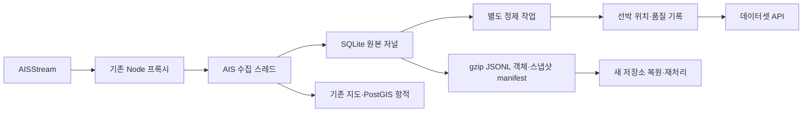

# 해양 클라우드 데이터 플랫폼

목표는 AIS·기상 등 해양 데이터를 지속적으로 수집·정제·축적하고, 조회 API·분석·AI·시뮬레이션에 재사용 가능한 데이터셋으로 제공하는 것이다. 기존 지도는 첫 번째 데이터 소비 애플리케이션이다.

2026-09-14 첫 구현 범위: **AIS 원본 보관 → 정제·품질 기록 → 조회 → 파일 내보내기·복원·재처리**. 클라우드 서비스와 비용 한도는 미정이며, 우선 로컬 실행을 구현했다. 실제 클라우드 리소스는 생성하지 않았다.

## 현재 구조와 선택



기존 `StreamProducer`·`StreamConsumer`는 현재 AIS 실수집 경로에 연결되어 있지 않다. 이번 구현은 실제 Node stdout 수신 경로에서 JSON 파싱 전에 원문을 보관한다. Node가 JSON을 다시 직렬화한 문자열이며, WebSocket 프레임 바이트 자체의 복제는 아니다.

로컬 단계에서는 추가 서비스 없이 트랜잭션과 재시작 복구를 검증하기 위해 SQLite WAL/FULL 동기화를 사용한다. 수집 스레드에서 저장 완료를 기다리며 FastAPI 이벤트 루프에서 디스크 I/O를 수행하지 않는다. 지도용 샘플링 항적과 전량 원본 보관을 분리한다. 이 구성은 단일 호스트용 staging이며 분산 메시지 브로커·데이터 레이크를 대체하지 않는다.

## API 키 없이 실행

저장 경로와 예제 데이터는 로컬 전용이다. 예제 선박·위치·시각은 모두 합성 데이터다.

```bash
# 원본 5건: 정상, 중복, 늦은 관측, 잘못된 좌표, 정적 정보
uv run python -m backend.data_platform --db var/data-platform/demo.sqlite3 ingest tests/fixtures/data_platform/ais-demo.jsonl
uv run python -m backend.data_platform --db var/data-platform/demo.sqlite3 process
uv run python -m backend.data_platform --db var/data-platform/demo.sqlite3 status
uv run python -m backend.data_platform --db var/data-platform/demo.sqlite3 positions 999000001
uv run python -m backend.data_platform --db var/data-platform/demo.sqlite3 export var/data-platform/demo-export
```

새 DB에서 시작하면 원본 5건, 정제 위치 2건, 품질 오류 1건, 중복 1건, 정적 정보 제외 1건이다. `process`를 다시 실행하면 처리 건수는 0이며 기존 결과는 유지된다. 같은 입력 파일을 다시 `ingest`하면 **원본 수신 기록은 추가**되지만 제공자 시각이 있는 동일 메시지의 정제 결과는 중복되지 않는다.

`export` 출력의 `manifest` 경로를 사용해 새 저장소에서 복원한다.

```bash
uv run python -m backend.data_platform --db var/data-platform/restored.sqlite3 restore var/data-platform/demo-export/manifest-<출력된해시>.json
uv run python -m backend.data_platform --db var/data-platform/restored.sqlite3 process
uv run python -m backend.data_platform --db var/data-platform/restored.sqlite3 status
```

복원은 원본 event ID·수신 시각·본문을 유지한다. 같은 manifest를 다시 복원해도 원본이 중복되지 않는다. 동일 event ID에 다른 본문이 있으면 오류로 중단한다. 부분 복원 실패 시 재실행할 수 있다.

## 실시간 수집 연결

`.env`에 다음을 설정하고 기존 백엔드를 실행한다.

```dotenv
DATA_PLATFORM_ENABLED=true
DATA_PLATFORM_DB=var/data-platform/journal.sqlite3
```

기존 AIS 프록시 연결 하나를 사용하며 추가 구독은 만들지 않는다. 정제는 수집과 분리된 작업으로 실행한다.

```bash
uv run python -m backend.data_platform process --follow
```

Docker Compose에서는 app의 `/app/var/data-platform`에 `platform_data` 영구 볼륨을 연결한다. 컨테이너 안의 동일 경로를 사용해 작업을 실행한다.

```bash
docker compose exec app python -m backend.data_platform process --follow
```

기본값은 보관 비활성이다. 기능 활성화는 저장 공간·수신 지연을 측정하면서 수행한다. 데모 DB를 API에서 보려면 `DATA_PLATFORM_DB`를 데모 경로로 지정한다.

- `GET /api/v1/datasets/status`: 활성 여부, 원본·정제·거부 건수, 미처리 건수, 체크포인트, 마지막 수신 시각.
- `GET /api/v1/datasets/positions/{mmsi}?limit=100`: 최근 위치를 시각 내림차순으로 조회. 최대 1,000건. 원본 event ID, 출처, 수신 시각, 변환 버전 포함.
- Prometheus `data_platform_capture_total{outcome="stored|failed"}`: 원본 저장 성공·실패. 실패한 수신은 저장 성공으로 계산하지 않는다.

## 데이터 계약과 복구 범위

| 계층 | 계약 |
|---|---|
| 원본 | 수신마다 UUID event ID, 단조 증가 로컬 seq, `source=aisstream`, UTC received_at, 파싱 전 payload 문자열. 잘못된 JSON과 중복도 보존 |
| 정제 위치 | 변환 버전 `ais-position-v1`, MMSI, 위경도, knots 속력, degrees 방위, event_time·time_basis, 원본 연결 |
| 품질 기록 | 변환 버전, 원본 seq, 거부 사유. 원본은 삭제하지 않음 |
| 체크포인트 | 버전별 마지막 처리 seq. 결과·오류·진행 위치를 한 트랜잭션으로 커밋 |
| 내보내기 | envelope v1, 수신 UTC 날짜·시간 파티션, SHA-256 파일명, gzip JSONL, 객체 목록을 고정한 manifest |

- `PositionReport`, `StandardClassBPositionReport`를 정제한다. 다른 메시지 유형은 원본만 보관하고 현재 위치 데이터셋에서는 제외한다.
- 제공자 `MetaData.time_utc`가 있으면 UTC로 정규화하고 `time_basis=provider`로 표시한다. 제공자 시각을 실제 센서 관측 시각으로 인증하지 않는다.
- 시각이 없으면 수신 시각을 사용하고 `time_basis=received`로 구분한다. AIS 보고의 초 단위 `Timestamp`만으로 전체 날짜를 추정하지 않는다. 이 경우 같은 본문의 반복 수신도 별개 관측으로 유지한다.
- 시간대 없는 제공자 시각, 잘못된 MMSI·좌표·비유한 수치 등은 품질 오류다. 위도·경도 0은 유효하다. AIS 미제공 표식(속력 102.3, COG 360, heading 511)은 null이다.
- 중복 제거 범위는 **제공자 시각이 있는 동일 JSON 내용**이다. MMSI와 시각만 같다는 이유로 서로 다른 관측을 합치지 않는다.
- 늦은 데이터도 이력에 포함한다. 체크포인트는 event_time이 아닌 수신 seq를 따른다.
- 새 정제 로직은 새 `VERSION`을 사용하면 원본을 처음부터 처리한다. CLI에는 임의 버전 이름만 바꿔 기존 로직을 재라벨링하는 옵션을 제공하지 않는다.
- 내보내기 데이터는 반드시 **하나의 manifest**에 지정된 객체만 읽는다. 추가 수신 후 내보내면 마지막 배치가 달라질 수 있어 폴더 전체 glob은 중복을 만들 수 있다. 스냅샷은 high_watermark 이후 수신을 제외한다.
- 보장 범위는 SQLite에 커밋된 원본부터다. 디스크 장애 시 기존 지도는 계속 동작하며 보관 실패를 기록한다. Node/네트워크 버퍼, 저장 실패, 서비스 연결 중단 구간의 데이터 무손실을 보장하지 않는다. 제공자도 과거 이벤트의 영구 재전송을 보장하지 않는다.

## 다음 단계와 완료 기준

| 단계 | 결과물 | 완료 기준 |
|---|---|---|
| 1 — 구현 | 원본 저널·정제·품질·API·복원 | 재시작, 중복, 오류, 늦은 수신, 트랜잭션 롤백, 복원 후 결과 일치 테스트 |
| 2 — 예정 | 클라우드 원본 저장·업로드 재시도·IaC | 버킷 접근 권한·암호화·보존 기간·비용 한도 결정, 업로드 확인 후 로컬 보존 정책 실행 |
| 3 — 예정 | Parquet 정제 데이터·카탈로그·SQL | 날짜·해역별 조회, 품질 리포트, 스키마 변경·재처리 절차 |
| 4 — 예정 | 기상 결합·분석 데이터셋 | 시간·공간 매칭 근거, 해역별 통행량·혼잡 지표, 동일 입력의 결과 재현 |
| 5 — 예정 | 운영 자동화·부하 검증 | 수신 처리량, p95 저장·조회 지연, 데이터 신선도, 복구시간, 일일 비용 측정 |

AWS를 선택할 경우 S3 원본/정제 계층, Glue Catalog·Athena 분석, IAM 역할, IaC 배포를 기준으로 설계를 구체화한다. 수집 실행 환경은 장기 연결·로컬 디스크 요구와 비용을 비교해 결정한다. Kafka·Spark·Kubernetes는 측정된 필요가 생기면 도입한다.

현재 미구현: S3 전송, Parquet, 기상 수집 통합, 자동 보존·삭제, 분산 처리, 인증·사용자별 권한, 부하·클라우드 운영 검증. 이번 단계는 기존 공개 지도 화면에 새 UI를 추가하지 않는다.

## 근거

- [AWS 데이터 계층 지침](https://docs.aws.amazon.com/prescriptive-guidance/latest/defining-bucket-names-data-lakes/data-layer-definitions.html): 원본·처리·분석 데이터 계층 분리.
- [AISStream 공식 문서](https://aisstream.io/documentation): 메시지 구조, 연결 제약, 소비 지연 시 유실과 영구 재전송 미제공.
