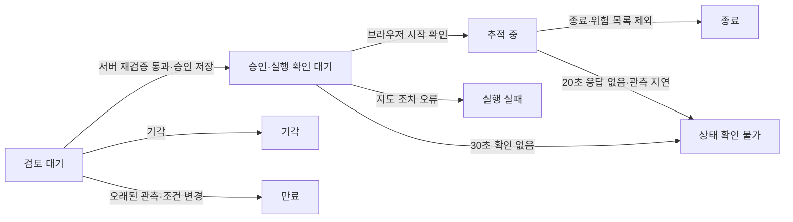

# 당직사관: 충돌 위험 제안·승인·지도 추적

2026-09-14 선택 복원. 기존 충돌 분석 결과에서 집중 추적을 제안하고, 운용자 승인 후 지도에서 두 선박을 추적한다. 승인과 실행 확인은 별도 상태이며 실행·종료 이력을 보관한다.

## 사용 방법

기존 서버를 실행하고 지도 화면의 **충돌 분석 → 제안** 탭을 연다.

```bash
uv run uvicorn backend.main:app --host 0.0.0.0 --port 8001
```

1. 충돌 분석 결과와 최신 수신 데이터가 제안 조건에 해당하면 카드가 나타난다.
2. **사건 검토 → AI로 현재 상태 확인**에서 조사 결과와 근거를 확인한다. 필요하면 선택 도구인 **속력·침로 조건 비교**로 조건을 비교하고 검토 화면으로 돌아온다.
3. 조사 결과가 집중 추적을 제안하면 판단 이유를 입력하고 **집중 추적 승인** 또는 **기각**을 선택한다. AI 없이 직접 판단하려면 카드의 접힌 **AI 조사 없이 직접 판단** 항목을 사용한다. 직접 판단의 빈 입력은 기존대로 ‘집중 추적 필요’·‘관망’으로 기록되며, AI 조사 화면은 이유 입력을 요구한다.
4. 승인 요청 시 서버가 최신 분석·선박 데이터와 현재 CPA를 다시 확인한다. 통과한 승인만 지도 조치를 실행한다.
5. 브라우저가 지도 강조·카메라 이동 요청·추적 타이머 시작을 확인한 뒤 서버에 실행 확인을 보낸다.
6. 승인한 카드의 **승인 후 상태 확인**에서 후속 관측을 살펴본다. **추적 종료**로 종료하거나 최신 위험 목록에서 해당 쌍이 제외되면 결과를 기록한다. 수동 지도 조작이나 추적 대상 변경으로 타이머가 멈춘 경우에도 종료를 기록한다.

열린 제안이 없을 때는 실제 위험을 기다린다. 합성 테스트 데이터는 `tests/test_watch_officer.py`에 있으며 실서비스 위험 데이터에 자동 주입하지 않는다.

## 상태와 기록



- 기록은 `WATCH_DB`의 SQLite WAL/FULL 트랜잭션에 저장한다. 기본값은 `var/data-platform/watch-officer.sqlite3`이다.
- 생성 근거, 규칙 버전·임계값, 승인 시 재계산 수치·선박 수신 시각, 판단 이유, 브라우저 실행 ID, 상태 전환 시각·이유를 보관한다.
- 같은 제안의 승인 트랜잭션에서 한 요청만 `execute=true`를 받는다. 재요청이나 다른 탭의 후속 승인은 실행 권한을 다시 발급하지 않는다.
- 승인 응답이 유실되면 화면 조치를 임의로 재실행하지 않는다. 시작 확인이 없으면 상태 확인 불가로 종료한다.
- 지도 실행 후 확인 응답만 유실되면 추적 동작을 반복하지 않고 동일 실행 ID의 확인을 재전송한다.
- 브라우저는 5초마다 상태를 확인하며, 추적 타이머·대상 선박이 유지되는 경우에만 실행 heartbeat를 보낸다. 브라우저 새로고침 후에는 자동 재실행하지 않는다.
- 완료·실패·만료된 기록은 늦게 도착한 실행 확인으로 다시 열리지 않는다.
- 같은 선박 쌍의 활성 제안은 중복 생성하지 않는다. 운용자가 **기각·종료**한 쌍만 기본 30분 cooldown(`WATCH_COOLDOWN_MIN`)을 적용하고, 관측 공백처럼 시스템 사정으로 끝난 제안에는 짧은 재시도 간격(`WATCH_RETRY_COOLDOWN_SEC`, 기본 60초)만 적용한다. 위험이 계속되는 쌍을 30분간 가리지 않기 위해서다.
- 관측 공백(`vessel_stale`·`vessel_missing`·`analysis_stale`)은 **위험 해소가 아니므로 검토 대기 제안을 닫지 않는다.** `관측 지연`으로 표시하고 승인만 막으며, 수신이 돌아오면 표시가 걷힌다. 공백이 `WATCH_STALE_GRACE_SEC`(기본 300초)를 넘기면 그때 만료한다. 승인은 `decide()`가 동일한 검증을 다시 수행하므로 안전선은 변하지 않는다.
- 동시에 열어두는 검토 대기 제안은 `WATCH_MAX_OPEN`(기본 10)으로 제한하고 ML 고위험 → DCPA 작은 순 → TCPA 임박한 순으로 채운다. 전역 피드에서는 임계값을 조여도 근접 쌍이 줄지 않으므로(운영 기록 시간당 551건, DCPA를 5nm→0.3nm로 낮춰도 290건) 경보 목록이 아니라 우선순위 보드로 운용한다. 정원은 **승인할 수 있는 사건만** 센다 — 관측 지연 사건까지 세면 AIS가 흔들릴 때 승인도 못 하는 사건이 자리를 막아 신선한 위험이 올라오지 못한다. 순서는 서버 `rank_key()` 한 곳에서 정하고 인계 요약·브라우저 알림이 같은 순서를 쓴다.
- 브라우저 하나에서는 승인받아 실행 중인 집중 추적 한 건을 관리한다. 추가 승인은 기존 추적 종료 후 수행한다.

## 제안·재검증 규칙

프로젝트 내부의 관측 우선순위 규칙이며 공인 운항 임계값은 아니다.

- 후보: ML 위험 등급 3 이상 또는 DCPA < 0.3 nm이고 0 < TCPA < 10분. 같은 쌍은 ML을 우선한다.
- 분석 캐시와 후보 분석 시각은 30초 이내, 두 선박의 로컬 AIS 수신 시각은 60초 이내여야 한다.
- 선박 위치·속력·진행방향 범위를 확인하고 현재 수신 상태에서 TCPA/DCPA를 재계산한다.
- CPA 후보는 같은 임계값을 다시 만족해야 한다. ML 후보는 최신 캐시의 고위험 분류가 유지되고, 현재 재계산에서 접근 중이며 DCPA ≤ 1 nm·TCPA ≤ 20분이어야 한다. 승인 시 ML 모델을 새로 호출하는 방식은 아니다.
- 위험 목록에서 사라졌더라도 분석 또는 선박 정보가 오래됐다면 해소로 기록하지 않고 상태 확인 불가로 기록한다.
- 위험 감소는 후속 관측이며, 화면 집중 추적으로 위험이 감소했다는 인과관계를 주장하지 않는다.

## 백엔드를 여러 개 띄웠을 때

제안 스캐너는 **DB 하나당 한 서버만** 돈다. 먼저 임대(`leases` 테이블, `WATCH_SCANNER_LEASE_SEC` 기본 120초)를 얻은 서버가 제안을 갱신하고, 같은 DB를 여는 나머지 서버는 화면·승인·인계만 제공하며 로그에 경고를 한 번 남긴다. 임대를 쥔 서버가 멈추면 임대 시간 뒤 다른 서버가 이어받는다.

임대가 없던 때 기준이 다른 두 서버(12081: `WATCH_DCPA_NM=5`, 12082: 기본 0.3nm)가 같은 DB를 동시에 갱신해, 한 시간에 제안 161건이 생성 직후 15초 안에 "조건 해소"로 닫혔다(2026-09-17 기록). 임대는 새 코드끼리만 효과가 있으므로 예전 코드로 떠 있는 서버는 재시작해야 한다.

정적 파일은 디스크에서 바로 읽히고 API 라우트는 서버를 띄운 시점의 코드로 고정된다. 그래서 새 화면이 예전 백엔드에 붙을 수 있다. 인계 화면은 이 경우(404·405)를 감지해 "백엔드를 재시작하라"고 안내하고 이어받기를 잠근다.

## 담당 해역

제안·알림·인계는 **담당 해역**(`WATCH_AOR_BOX`, "minLat,minLng,maxLat,maxLng") 안의 사건만 새로 만든다. 상황판에 보이는 **수신 범위**(`AIS_BOUNDING_BOX`)와 별개다 — 수신을 좁히면 상황판까지 줄어들기 때문이다. 기본값은 한국 근해 사각형 근사 `32,124,39.5,132`다(부산·인천·목포·제주·포항·동해·울릉도·독도 포함, 홍콩·상하이·칭다오·도쿄·오사카 제외, 대한해협을 공유해 후쿠오카 근해 포함). 비우면 기본값, `off`면 수신 범위 전체에서 제안한다.

- 두 선박 중 **한 척이라도** 안에 있으면 담당 사건이다. 경계를 가로지르는 쌍을 놓치지 않기 위해서다. 위치를 알 수 없으면 포함한다.
- 필터는 **새 제안에만** 건다. 이미 열린 해역 밖 사건은 기존 규칙대로 검증·종료된다. 필터를 기존 사건까지 걸면 해역 밖 사건이 "조건 해소"로 잘못 만료되고, 추적 중 사건은 "위험 감소"로 잘못 기록되기 때문이다.
- 설정 값이 틀리면(숫자 아님, 최소>최대) 오류를 로그에 남기고 **필터를 끈다.** 오타로 담당 해역이 조용히 좁아지면 위험을 놓치지만, 넓어지면 사건이 더 보일 뿐이다.
- 사각형만 지원한다. EEZ·작전구역 같은 다각형은 `watch_officer.in_aor`를 바꿔야 한다.

제안 탭과 인계 화면에 현재 담당 해역을 표시한다.

## 브라우저 알림

제안 탭의 **알림 켜기**로 운영체제 알림을 받는다. 제안은 시간당 수백 건씩 바뀌므로 전부 알리지 않고 두 가지만 알린다.

- **최근접 임박:** TCPA 5분 이하
- **최상위 변동:** 새로 가장 위험한 순위에 오른 사건

관측 지연 사건은 승인할 수 없으므로 알리지 않는다. 같은 선박쌍·같은 종류는 10분 안에 다시 알리지 않는다. 화면을 연 순간 이미 쌓여 있던 사건은 기준으로만 삼고 울리지 않는다. 여러 건은 알림창 하나로 합친다. 운용자가 제안 탭을 보고 있으면 울리지 않는다. 알림을 누르면 충돌 패널의 제안 탭과 해당 사건의 사건 검토가 열린다. **알림으로는 승인할 수 없다** — 승인은 서버 재검증 → 브라우저 지도 추적 → 실행 영수증이 한 사슬이라 알림에서 승인하면 영수증이 빠진다.

브라우저 알림은 https 또는 localhost 주소에서만 동작한다. 사내 IP로 http 접속하면 버튼 대신 그 이유를 표시한다. 판정은 `notableAlerts()`(순수 함수)이며 `tests/js/watch-officer.test.mjs`가 검증한다.

## 당직 인계

제안 탭의 **당직 인계**는 지난 인계 이후의 기록을 한 화면에 모은다: 지금 판단이 필요한 사건(위험 순서), 추적 중인 사건, 지난 인계 이후 판단. 당직자 이름과 선택 메모를 적고 **이어받기**를 누르면, 그 순간 열려 있던 사건 목록과 함께 인계 기록이 `handoffs` 테이블에 남는다. 이름은 로그인으로 확인하지 않는 자기 기재 값이다. 인계 기록이 없으면 최근 12시간을 보여준다.

- `GET /api/v1/proposals/handoff`: 요약(`last_handoff`, `open`, `active`, `decisions`)
- `POST /api/v1/proposals/handoffs`: `operator`(1~40자, 앞뒤 공백 제거), `note`(0~500자), `client_id`

메일·메신저 연동은 없다. 알림은 이런 채널로 붙일 수 있지만 인계는 상태가 10초마다 바뀌므로 앱 안에서 해야 한다.

## 연결부와 범위

- `backend/services/watch_officer.py`: 규칙·재검증·SQLite 상태 전환.
- `backend/routers/proposals.py`: 목록, 결정, 실행 확인 API.
- `static/js/watch-officer.js`: 제안 UI와 승인 후 실행 순서, heartbeat.
- `static/js/collision.js`: 기존 2D/3D 지도 기능을 이용하는 집중 추적과 상태 확인.
- 기존 충돌 스캐너가 분석 후 제안을 갱신한다. 목록 조회도 상태 만료·후속 위험을 확인한다.
- `GET /api/v1/proposals?limit=100`
- `POST /api/v1/proposals/{id}/decision`: outcome, reason, client_id.
- `POST /api/v1/proposals/{id}/execution`: execution_id, client_id, outcome, reason.

현재 실행 확인은 승인한 브라우저의 지도 추적 시작 보고다. 실제 선박에 감속·변침 명령을 전송하지 않는다. client_id는 브라우저 구분용이며 사용자 인증·조직 권한을 대신하지 않는다. 실행 확인이 없는 상태를 실행 성공으로 표시하지 않는다.

현재 데이터 플랫폼은 유지한다. RAG·벡터 검색·지식그래프, LLM 브리핑과 별도 지휘통제 콘솔은 이번 복원 범위에 포함하지 않는다. 근거는 현재 분석 수치·규칙·관측 시각·판단 기록으로 제공한다.

기존 `backend/cache/proposals.jsonl`와 `_archive/`의 보관본은 그대로 유지한다. 과거 승인에는 실행 확인이 없으므로 새 실행 기록으로 자동 변환하거나 재실행하지 않는다. 새 기록은 별도 SQLite에 저장한다. Docker Compose에서는 `platform_data` 영구 볼륨을 사용한다.

## 검증

```bash
uv run pytest tests/test_watch_officer.py tests/test_proposals_api.py
node --test tests/js/watch-officer.test.mjs
```

검증 대상: 같은 쌍 중복·cooldown, 동시 승인에서 단일 실행 권한, 데이터 지연·위험 변경 차단, 저장 실패 시 실행 권한 미발급, 실행 소유 탭 확인, 실패·응답 유실 구분, 종료 후 늦은 확인 차단, 승인 이전 조치 미실행, 실행 확인 재전송 시 조치 중복 미실행.

2026-09-14 검증 결과: Python 전체 145개 통과·2개 skip, 기존 `test_route_interpolation_density` 실패 1건(이번 변경 전에도 동일). JS 테스트 파일 3개 통과. 합성 선박을 제공하는 임시 서버와 headless Chrome에서 실제 제안 카드 승인 → 지도 추적 시작 → 운용자 종료를 확인했고 JavaScript 예외 및 390px 가로 넘침은 없었다. 외부 실시간 AIS와의 장시간 운용 검증은 포함하지 않는다.

## 시나리오 검토와 후속 확인

제안 카드의 **시나리오 비교**에서 시작한 비교에는 제안 ID, 당시 제안 revision·위험 근거·규칙을 고정 저장합니다. 비교 화면 아래에서 **참고안 / 보류 / 미채택**과 이유를 기록할 수 있습니다. 동일 선박 쌍이라도 다른 제안에서 시작한 비교는 연결하지 않습니다. 검토 기록 자체는 제안 상태를 승인으로 바꾸거나 운항 명령을 실행하지 않습니다.

집중 추적을 승인하면 당시 연결되어 있던 검토 기록 ID 목록을 승인 기록에 고정합니다. 이후 추가 검토는 앞선 승인의 근거를 바꾸지 않습니다. 제안의 판단 근거·이력에서 비교를 다시 열 수 있습니다. 검토 저장은 요청 ID로 중복을 방지하며 최대 50건을 유지합니다.

**후속 확인**은 수신 위치로 계산한 선박 간 거리, CPA 규칙 상태, 거리 변화 그래프를 보여줍니다. 검토 후에는 해당 비교의 예측 종료 시점까지, 승인 후에는 30분간 관측을 시도합니다. 둘 중 긴 기간을 적용하며, 지도 추적 종료와 별개로 남은 관측 기간에는 데이터를 기록합니다. 수신이 없거나 오래되면 `대기/수신 지연`으로 표시하고 위험 감소로 처리하지 않습니다. 기간이 끝나면 마지막 값을 과거 기록으로 표시합니다.

제안마다 최신 1,200개 관측을 저장하고 수신 시각 쌍이 같은 데이터는 중복 저장하지 않습니다. 비교 지도에는 녹색 실제 수신 항적을 표시합니다. 각 선박의 로컬 수신 시각에서 기준·변경 예측과 위치 차이를 계산합니다. 이것은 변경안 실행 여부나 충돌 회피 성공을 입증하는 수치가 아닙니다. 수신 이전 과거 항적을 자동 복원하지 않으며, 선박이 미수신 상태이면 오차 계산도 추가하지 않습니다.

추가 API:

- `POST /api/v1/proposals/{id}/scenario-reviews`: 비교 ID·검토 결과·이유·요청 ID 저장
- `GET /api/v1/proposals/{id}/followup?run_id=...`: 관측 이력·신선도·선택 비교의 위치 오차

현재 `client_id`는 브라우저 세션 식별값이며 인증된 사용자 신원이 아닙니다. 로컬 단일 사용자 운용을 기준으로 하며 다중 사용자 로그인·권한은 아직 적용하지 않았습니다.
